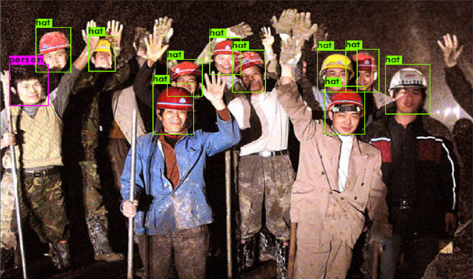
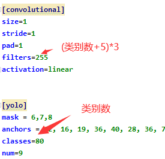

# keras-yolov4

[](LICENSE)

## Introduction

来源于AlexeyAB大佬的框架 [https://github.com/AlexeyAB/darknet](https://github.com/AlexeyAB/darknet).
框架来源于qqwweee大佬的 [https://github.com/qqwweee/keras-yolo3](https://github.com/qqwweee/keras-yolo3)
之前看到有人做了个Test的，但其实并不完整，这个版本我加入了可以通过Camera和图片的检测，使项目较为完整


## 环境
- Python3.7.3
- keras2.2.5
- tensorflow1.14.0
- CUDA10.1
---

## 直接开始玩

1. 从谷歌下载Darknet的权重文件 [yolov4.weights](https://drive.google.com/open?id=1cewMfusmPjYWbrnuJRuKhPMwRe_b9PaT).
2. 把Darknet的.weights文件转换为keras的h5文件
3. 开始检测
```
python convert.py
python yolo_video.py --input [video_path] --output [output_path (optional)] #视频
python yolo_video.py  --image #图片
```
## 全部用法
>移步到qqwweee大佬的仓库
[https://github.com/qqwweee/keras-yolo3](https://github.com/qqwweee/keras-yolo3)


## 训练
>其实个人建议还是用Darknet进行训练效率和效果都是更好的，但是可能大家计算机基础不太一样，还是写写keras版本的训练方法吧。

1.  数据集的制作用imagelabel，会产生xml文件，并且文件名和图片名是对应的
2.  将xml文件全部放入到VOCdevkit/VOC2007/Annotations，把图片放到VOCdevkit/VOC2007/JPEGImages
3.  在VOCdevkit/VOC2007/ImageSets中创建三个文件夹Layout,Main,Segmentation(这里已经帮你创建好了)
4.  在VOCdevkit/VOC2007/目录下创建gen.py,并执行gen.py文件生成VOC2007数据说明文本文件(train.txt,val.txt,test.txt)
5.  修改voc_annotation.py：在第六行的classes项中修改成自己训练样本的名字
6.  执行voc_annotation.py生成可供该框架使用的数据集文件(在根目录生成2007_train.txt,2007_test.txt,2007_val.txt)
7.  修改参数文件yolo4.cfg如下图
8.  修改model_data/voc_classes.txt，为自己需要训练的类别
9.  开冲！文件模型保存在logs/000/里面，后面运行的时候记得，在yolo.py里面修改名字


```
# gen.py

import os
import random
 
trainval_percent = 0.2
train_percent = 0.8
xmlfilepath = 'Annotations'
txtsavepath = 'ImageSets\Main'
total_xml = os.listdir(xmlfilepath)
 
num = len(total_xml)
list = range(num)
tv = int(num * trainval_percent)
tr = int(tv * train_percent)
trainval = random.sample(list, tv)
train = random.sample(trainval, tr)
 
ftrainval = open('ImageSets/Main/trainval.txt', 'w')
ftest = open('ImageSets/Main/test.txt', 'w')
ftrain = open('ImageSets/Main/train.txt', 'w')
fval = open('ImageSets/Main/val.txt', 'w')
 
for i in list:
    name = total_xml[i][:-4] + '\n'
    if i in trainval:
        ftrainval.write(name)
        if i in train:
            ftest.write(name)
        else:
            fval.write(name)
    else:
        ftrain.write(name)
 
ftrainval.close()
ftrain.close()
fval.close()
```
